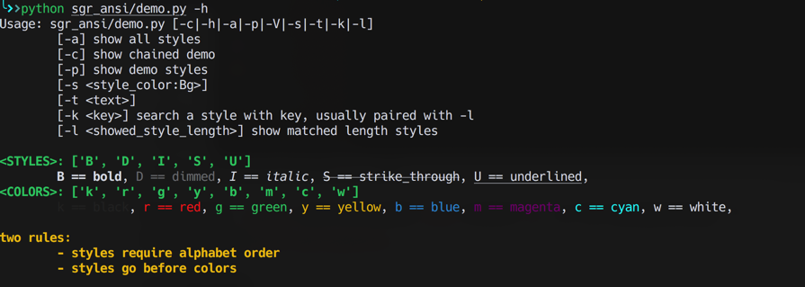

# sgr-ansi

awesome SGR ANSI colorful text interface in terminal

> full supported in python3.7+, macosx

## awesome colorful text




## install

```shell
pip install sgr-ansi
```

## usage

Beware of two rules:
- styles require **alphabet order**
- styles go before colors

about styles, you can use as many as possible, but colors only the last two will take effect

so like `BDISUkrgybmcw`, all `BDISU` will take effect, but for colors only `cw: cyan on white` will take effect

### styles/colors supported

> styles

B: bold, D: dimmed, I: italic, S: strike_through, U: underlined

> colors

k: black, r: red, g: green, y: yellow b: blue, m: magenta, c: cyan, w: white


```python
import sgr_ansi as echo

echo.BIg()
echo.BIg('I love you 3 thousand times')
```

### chained call

```python
from sgr_ansi import Chain

Chain().BIy('Yep,').BIUb(
    'How do you like this?'
).Bm('\n\t[✔]').BUg('1.').Bg('Y: yes.').Bm('\n\t[✘]').BUr('2.').Br('N: not.').show()
```


## run demo

> just run `sgransi` to check all available styles

```sh
# after installed sgr_ansi, cli sgransi is available
sgransi -h
```
