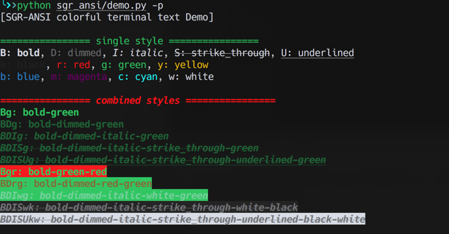

# sgr-ansi

awesome SGR ANSI colorful text interface in terminal

> full supported in python3.7+, macosx

## awesome colorful text




## install

```shell
pip install sgr-ansi
```

## usage:

only two rules:
- styles require alphabet order
- styles go before colors

about styles, you can use as many as possible, but colors only the last two will take effect

so like `BDISUkrgybmcw`, all `BDISU` will take effect, but for colors only `cw: cyan on white` will take effect

### supported

> styles

B: bold, D: dimmed, I: italic, S: strike_through, U: underlined

> colors

k: black, r: red, g: green, y: yellow b: blue, m: magenta, c: cyan, w: white


```python
import ct

ct.BIg()
ct.BIg('I love you 3 thousand times')
```

## run demo

> just run demo.py to check all available styles

```shell
python ct/demo.py -h
```
